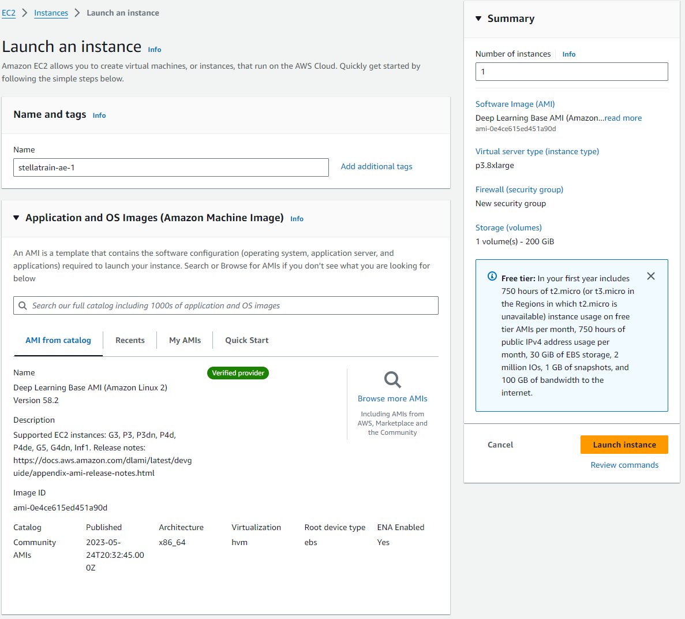

# StellaTrain (SIGCOMM 2024)

The repository is a public version of StellaTrain implementation.

## Project Structure

- `backend/src/optim`: CPU sparse optimizer for SGD and Adam &rarr; **3.1 CPU-based Sparse Optimizer**
- `backend/src/compress`: Gradient sparsification method (e.g. Top-k, threshold-v, thresholdv16(Cache-aware)) &rarr; **3.2 CPU-based Gradient Sparsification**
- `backend/src/engine/core.cpp` and other code (`backend/src/engine/comm_manager,cpp, core_module_api.cpp, shm_manager.cpp, task.cpp, threadpool.cpp`): Responsible for the main process and scheduling of Stellatrain &rarr; **3.3 Efficient Pipeline Management**

- `backend/src/telemetry_*.cpp`: Asynchornous data update for optimization &rarr; **4.1 The telemetry server**

- `backend/src/engine/batch_rate_alloc*.py`: Adaptive optimization for variable bandwidth &rarr; **4.2, 4.3 The centralized controller**

- `bayesian/profile`: Offline bayesian optimization
    

## How to run experiments
### Setup

Hardware requirements for running the experiments are as follows:
- \>= 2 nodes connected via network
- \>= 2 NVIDIA GPUs per node (with memory of 16GB or more)

We recommend using AWS EC2 instances for the experiments. Launch **two** instances with the following configurations:
- p3.8xlarge (4 NVIDIA V100 GPUs)
- [Deep Learning Base AMI (Amazon Linux 2) Version 58.2](https://docs.aws.amazon.com/dlami/latest/devguide/overview-base.html)
- Disk space of 200 GB
- Allow **all TCP ports** in the security group of the instances.



### Run container image
Execute the script to build and run the Docker image.
It pulls image from `ghcr.io/kaist-ina/stellatrain:main` and launch bash inside the docker container.

```bash
REPO=ghcr.io/kaist-ina/stellatrain:main
docker pull $REPO
docker run -it --rm --gpus all --ipc=host --net=host --ulimit memlock=-1 --ulimit stack=67108864 $REPO
```

### Run test script
You can run script below to test distributed training without dataset. Note that loss may diverge without downloading dataset.

In the server 1 (master server), run:
```bash
test_script.sh --master-ip-address <master server public IP address> --my-ip-address <server 1 public ip address> --world-size 2 --num-gpus 2 --rank 0
```

In the server 2, run:
```bash
test_script.sh --master-ip-address <master server public IP address> --my-ip-address <server 2 public ip address> --world-size 2 --num-gpus 2 --rank 1
```

### Run test with ImageNet

If you wish to perform training with real dataset, download the ImageNet dataset and follow the instructions below.

- Download ImageNet dataset from [ImageNet Website](https://www.image-net.org/download.php).

- Run docker on each server with the following command:
    ```bash
    REPO=ghcr.io/kaist-ina/stellatrain:main
    DATASET_PATH="{your dataset path}"
    docker pull $REPO
    docker run -it --rm --gpus all --ipc=host --net=host --ulimit memlock=-1 --ulimit stack=67108864 -v "$DATASET_PATH":/datasets $REPO
    ```

- In the server 1 (master server), run
    ```bash
    test_script_imagenet.sh --master-ip-address <master server public IP address> --my-ip-address <server 1 public ip address> --world-size 2 --num-gpus 2 --rank 0
    ```
- In the server 2, run
    ```bash
    test_script_imagenet.sh --master-ip-address <master server public IP address> --my-ip-address <server 2 public ip address> --world-size 2 --num-gpus 2 --rank 1
    ```